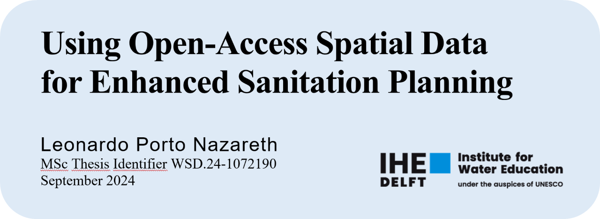

<h1 align="center">
  
</h1>

<h4 align="center">
  This research is done for the partial fulfilment of requirements for a Master of Science degree at the  
  IHE Delft Institute for Water Education, Delft, the Netherlands.
</h4>

   
  <em>Leonardo Porto Nazareth</em>

  <a href="#thesis-pdf">Thesis (PDF)</a> •
  <a href="#installation">Installation</a> •
  <a href="https://github.com/leonazareth/OpenSpatialSanitation/blob/main/User_Manual.md">User Manual</a> •
  <a href="https://github.com/leonazareth/OpenSpatialSanitation/blob/main/Population_datasets.md">Population Datasets</a> •
  <a href="#resources">Resources</a> •
  <a href="#credits">Credits</a> •
  <a href="#license">License</a>

---

<table>
<tr>
<td>

This repository contains **QGIS scripts** developed to support the methodology proposed in the thesis, which aims to **enhance early-stage sanitation planning** using **open-access spatial data**.

The proposed methodology is developed to help sanitation planners and other stakeholders, such as utilities and decision-makers, incorporate spatial data into sanitation planning.

By integrating datasets—like gridded population, streets and paths registers, and building footprints—these tools ease identifying context-appropriate sanitation solutions.

This repository also includes documentation on installing and using the scripts and relevant information for effective planning.

(Intro)

</td>
</tr>
</table>

## Thesis (PDF)

**Using Open-Access Spatial Data for Enhanced Sanitation Planning** (MSc Thesis, IHE Delft, 2024)  
Author: Leonardo Porto Nazareth

➡️ **Download the thesis (PDF):**  
- [`Nazareth_2024_MScThesis_OpenAccessSpatialData_SanitationPlanning.pdf`](thesis/Nazareth_2024_MScThesis_OpenAccessSpatialData_SanitationPlanning.pdf)

### What the thesis covers (1-minute summary)
This thesis investigates how **open-access spatial datasets** combined with **open-source GIS (QGIS)** can support **early-stage sanitation planning**, especially where official data is outdated or coarse. It proposes a workflow and QGIS scripts to delineate subareas, compute indicators, and suggest context-appropriate sanitation system types, demonstrated in **Boca Chica, Dominican Republic**.

### How to cite
Nazareth, L. P. (2024). *Using Open-Access Spatial Data for Enhanced Sanitation Planning* (MSc thesis, IHE Delft Institute for Water Education).

License: CC BY-NC 4.0.

## Resources
- 📘 Thesis (PDF): `thesis/Nazareth_2024_MScThesis_OpenAccessSpatialData_SanitationPlanning.pdf`
- 🧭 User Manual: [`User_Manual.md`](User_Manual.md)
- 🌍 Population datasets: [`Population_datasets.md`](Population_datasets.md)
- 📦 Script + styles bundle: [`Download_Resources/Scripts_Styles.zip`](Download_Resources/Scripts_Styles.zip)

## Installation

The step-by-step instructions for manually downloading and installing the scripts in QGIS are described below.

### Downloading

1. Go to: <a href="https://github.com/leonazareth/OpenSpatialSanitation/blob/main/Download_Resources/Scripts_Styles.zip">Download_Resources/Scripts_Styles.zip</a>
2. Click on the “...” button at the top right of the page.
3. Click on “Download” and select a directory on your computer to save the `.zip` file.

*Note: The `.zip` file contains the scripts developed and the styles that will be used later.*

4. Unzip the folders from the `.zip` file into a directory on your computer.

### Installing

1. Open QGIS.
2. Go to *View > Panels > Processing Toolbox Panel*.
3. At the top of the Processing Toolbox panel click on the second “Scripts” button.
4. Select the “Add Script to Toolbox” option.
5. Select the *Scripts* folder from the unzipped directory.
6. Select all the scripts (`.py` files) and click “Open”.
7. The scripts will be added to the Scripts section of the Processing Toolbox panel.

## Credits

Author: Leonardo Porto Nazareth.

All the material contained in this repository is part of the thesis of the MSc programme in Water and Sustainable Development (Water and Health and Governance and Management), at the Institute for Water Education, Delft, Netherlands.

The layout was inspired by the repository <a href="https://github.com/ArmynC/ArminC-AutoExec">ArminC-AutoExec</a>.

## License

- **Code/scripts and repository documentation**: MIT License (see [`LICENSE`](LICENSE)).
- **Thesis PDF**: Creative Commons Attribution–NonCommercial 4.0 International (**CC BY-NC 4.0**).

