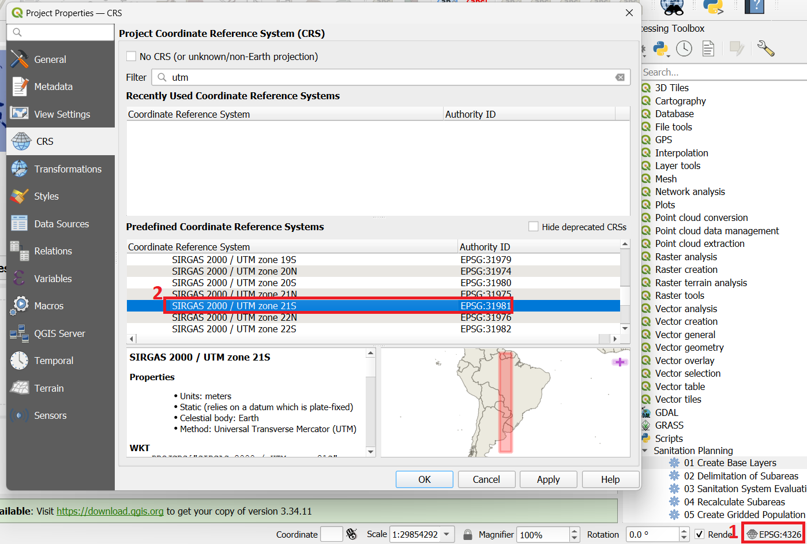
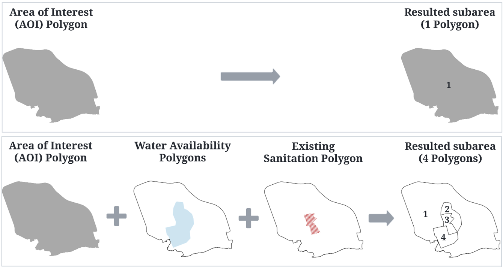
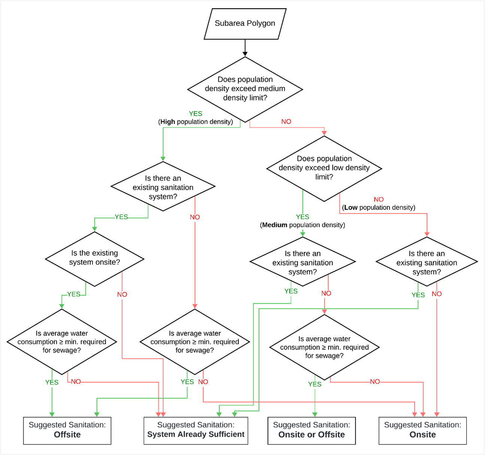
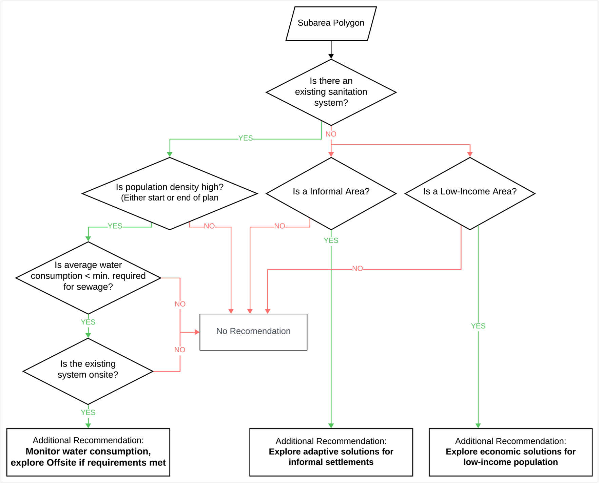

<h2 align="center">User Manual</h2>

   
  <em>Leonardo Porto Nazareth</em>

---

## Table of Contents

1. [Creating and configuring a new project in QGIS](#creating-and-configuring-a-new-project-in-qgis)
2. [Project settings](#project-settings)
3. [Step One - Create Base Layers](#step-one---create-base-layers)
   - [Creating the base layers (configuring and running the script)](#creating-the-base-layers-configuring-and-running-the-script)
   - [Delimiting the Areas](#delimiting-the-areas)
4. [Step Two - Delimitation of Subareas](#step-two---delimitation-of-subareas)
   - [Creating the Subareas](#creating-the-subareas)
   - [Advanced Parameters (Optional)](#advanced-parameters-optional)
5. [Step Three - Sanitation System Evaluation](#step-three---sanitation-system-evaluation)
   - [Calculating indicators and suggested sanitation system](#calculating-indicators-and-suggested-sanitation-system)
6. [Adjustments to the Subareas](#adjustments-to-the-subareas)
   - [Adjustments to Parameters](#adjustments-to-parameters-without-changing-subarea-geometry)
   - [Adjustments to Subarea Geometry](#adjustments-to-subarea-geometry)

The step-by-step instructions for using the scripts developed are described below.

## Creating and configuring a new project in QGIS

The first step in using the scripts you have created is to create a new project in QGIS.

1. Open QGIS.

2. Click on the “New Project” button in the top left-hand corner of the window.

3. Choose the directory where the new project will be saved and the name of the project.

4. Add the project layers, for example a vector layer with the administrative regions, or a raster layer with the available satellite image.

*Note: we recommend using the QGIS plugin “QuickMapServices” to add satellite image base layers or OpenStreetMaps.*

*Note2: you can download the project and base files used in the research case study (city of Boca Chica, Dominican Republic) from the <a href="https://github.com/leonazareth/OpenSpatialSanitation/blob/main/Example_project/Example_project_Boca_Chica.zip">LINK</a> However, the water consumption data of the polygons has been altered for privacy reasons*

## Project settings 

In order for the scripts to work correctly, some settings must be made in the project:

1. The project must be configured with a Coordinate Reference System (CRS) that uses the mercator projection and the metos unit. To do this, after creating the project and adding the vector layers, the user must click on the button in the bottom right-hand corner of the screen, which indicates the project's current EPSG code, and in the window displayed select the CRS of the location they are working in.

Example of a Mercator CRS configuration using meters:

2. The *Styles* folder downloaded with the scripts must be saved in the same directory as the QGIS project.
For example, if the Exemplo_sanitation.qgz project is saved in the *“C:/user/QGIS_project”* directory, the Styles folder must be saved in the same location.

*Note: This must be done for every new project in which the user wants to use the scripts developed.*

## Step one - Create Base Layers

The Create Base Layers script is designed to assist planners in defining project areas and ensuring that all necessary data is included. It facilitates the process of creating and organizing essential spatial information for sanitation planning.

The Create Base Layers script generates standardized layers essential for sanitation planning:

- **Area of Interest (AOI)** – Mandatory layer
- **Existing Sanitation Systems** – Auxiliary layer
- **Water Availability** – Auxiliary layer
- **Administrative Boundaries** – Auxiliary layer

Additionally, under the *Advanced Parameters*, the script can optionally generate a Population Density Grid.

### Creating the base layers (configuring and running the script):

1. Open the **Processing Toolbox Panel** and double-click on **01 Create Base Layers** under the *Scripts > Sanitation Planning* section.

2. In the **Processing Algorithm Window**, select the checkboxes for the layers you wish to create.

3. Ensure a **Mercator CRS (meter-based)** is selected (if not, manually select one).

4. Choose the **format** and **directory** for the output layers. If no directory is specified, the script will generate **temporary layers**.

   *Note: Temporary layers will be lost when QGIS is closed, even if the project is saved.*

5. Click **Run** to execute the script.

#### Advanced Parameters (Optional)

1. To generate a population density grid, expand the *Advanced Parameters* by clicking the arrow beside it.

2. Specify the **extent** for the grid creation (e.g., the current map canvas extent).

3. Choose either a **Raster** or **Vector** layer that contains population data. For **Vector** layers, select the field that stores the population data.

4. Provide additional information such as:
   - The **year** of the population dataset,
   - The **type** and **size** of the grid to be created,
   - The **annual growth rate**, and
   - The **target year** for the population projection.

   *Note: The population will be projected to the target year using a linear growth model, and the population density will be calculated accordingly.*

### Delimiting the Areas:

To delimit the areas, follow these steps:

1. Select the layer you want to use for delimitation. For example, to outline the project area, select the **AOI (Area of Interest)** layer.

2. Toggle the selected layer to **Edit Mode**.

3. Use the **Drawing Features** tool in QGIS to begin delineating the area of interest for the project.

4. Once you have finished drawing, right-click to complete the shape, and then click **OK** in the form dialog.

5. Depending on the layer in use, certain mandatory information may need to be entered before clicking **OK** in the form window.

*Note: To edit, delete, or modify the attributes of the polygons, use QGIS’ native tools, such as Delete Features, Vertex Tool, or Attribute table.*

## Step Two - Delimitation of Subareas

Subareas are the smallest polygons formed by the intersection of the layers created in the previous step.

The delimitation of the subareas is not done manually. Instead, the algorithm **02 - Delimitation of Subareas** automatically generates them by intersecting all the parent layers defined in Step 1. The subareas are consolidated into a single layer, with all attributes combined and organized accordingly.

### Creating the Subareas:

1. Double-click on **02 - Delimitation of Subareas** under the *Scripts > Sanitation Planning* section.

2. Select the layers with the delimited areas created in Step One.

3. Define the **minimum size** for the subareas. This helps to avoid generating small polygons in the gaps between previously delimited areas.

4. Choose the name and directory for the Subarea Layer.

5. Click **Run** to execute the algorithm.

#### Advanced Parameters (Optional)

1. It is also possible to generate a population density grid in this script, just like in step 1, but it automatically clip the grids at the AOI boundaries.

*Note: You can modify the attributes of the subareas at any time. This can be done using the attribute table or the Identify tool by clicking on the polygon and editing it via the feature form.*

## Step Three - Delimitation of Subareas

This process creates a **Subarea Sanitation Suggestion** layer, by calculating indicators and the most suitable sanitation system for each subarea. 

The population dataset is a mandatory input (raster or vector format), while streets, paths, and building footprint layers are optional data.

*Required Input Parameters*:
  - Population Dataset Year: Year of the population dataset
  - Low-Density Population Limit: Upper limit for low population density (inhab./ha)
  - Medium-Density Population Limit: Upper limit for medium population density (inhab./ha)
  - Annual Growth Rate: Annual population growth rate (%)
  - Plan Start Year: Year the plan starts
  - People per Household (Start): People per household at the start of the plan
  - Plan End Year: Year the plan ends
  - People per Household (End): People per household at the end of the plan
  - Water Consumption Requirement: Minimum water consumption required for sewerage systems (L/inhab./day)
  - Average Street Width (Optional)

The **suggested sanitation system [left]** (for the start and end of the plan) and **additional recommendations [right]** are calculated based on the following decision trees. These results are added as attributes in the generated layer:

  
  

Population projections are calculated using a simple linear projection based on the provided annual growth rate and the years of the dataset, plan start, and plan end. 

Population density is classified into low, medium, or high density based on the subarea’s projected population.

### Calculating indicators and suggested sanitation system:

1. Double-click on **03 - Sanitation System Evaluation** under the *Scripts > Sanitation Planning* section.

2. Select the **subarea layer** (created in Step Two).

3. Choose a **population dataset** (raster or vector). If using a vector, specify the field that contains the population data.

4. Input the required parameters.

5. Specify the **name** and **directory** for the output layers. The algorithm will generate several layers, clipped by the external boundary of the subarea layer:
   - Reprojected and clipped population dataset
   - Population points layer (each point represents a pixel or polygon of the population dataset)
   - Clipped street layer
   - Clipped building footprint layer
   - Subarea calculated layer with indicators, sanitation suggestions, and additional recommendations

6. Click **Run** to execute the algorithm.

**IMPORTANT:** The *Population points*, *Clipped street*, and *Building footprint* layers must not be deleted or renamed after they are generated. Doing so will cause issues with the recalculation algorithms explained in the following sections.

## Adjustments to the Subareas

Tools and scripts have been developed to allow users to make adjustments and modify the parameters of each **Subarea Sanitation Suggestion** feature individually, if needed, and quickly recalculate the associated indicators and results.

There are two types of adjustments, each with its own recalculation method:

### Adjustments to Parameters (without changing subarea geometry)

To adjust parameters without altering the geometry:

1. Toggle **Edit Mode** on the subarea result layer.

2. Select the **Identify Features** tool.

3. Click on the desired subarea.

4. Modify the parameter(s) in the form.

5. Click the **Recalculate Subarea** button at the bottom of the form.

6. Click **OK** to confirm the changes.

7. Save the layer.

### Adjustments to Subarea Geometry

To adjust the geometry of subareas:

1. Toggle **Edit Mode** on the subarea result layer.

2. Use QGIS' native tools to edit the geometries (e.g., move vertices, merge subareas, or subdivide).

3. Run the script **04 - Recalculate Subareas**.

4. Select the **Subarea Sanitation Suggestion** layer.

5. Check the option to **Recalculate for changes in geometries**.

6. Click **Run** to execute the recalculation.

